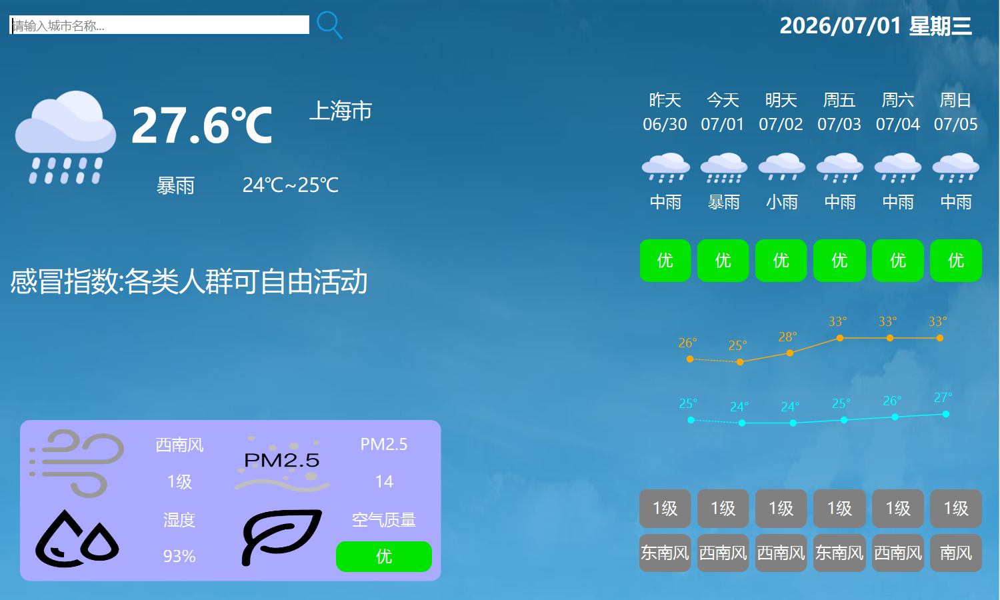
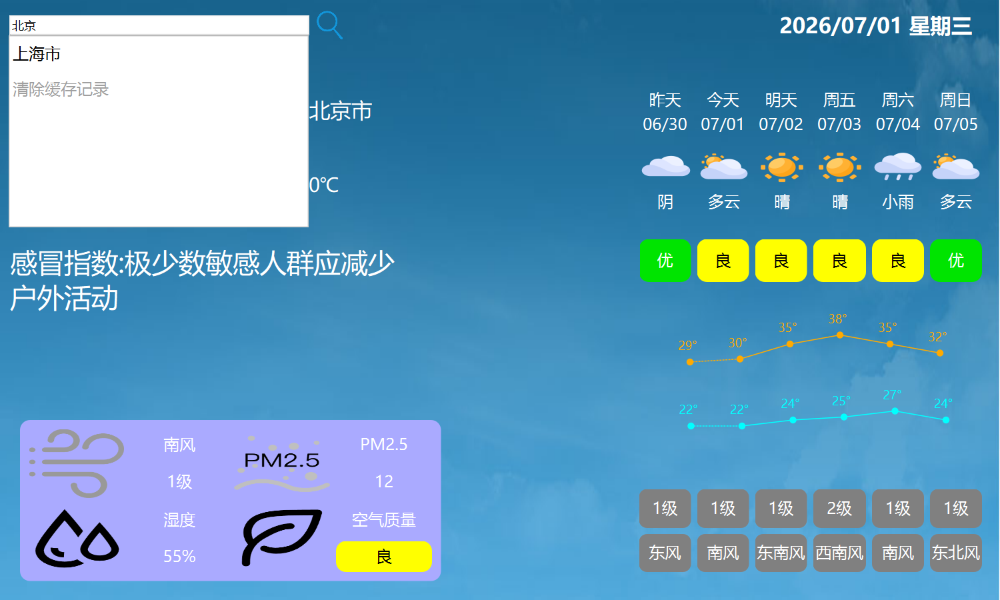
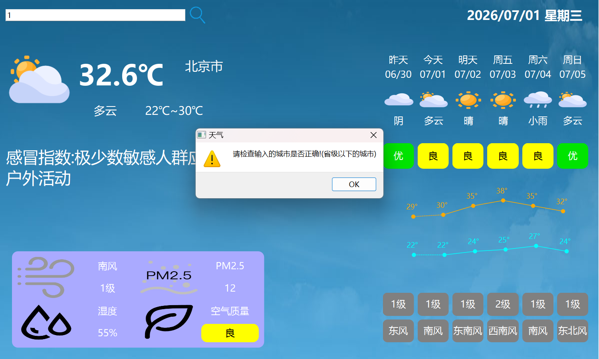
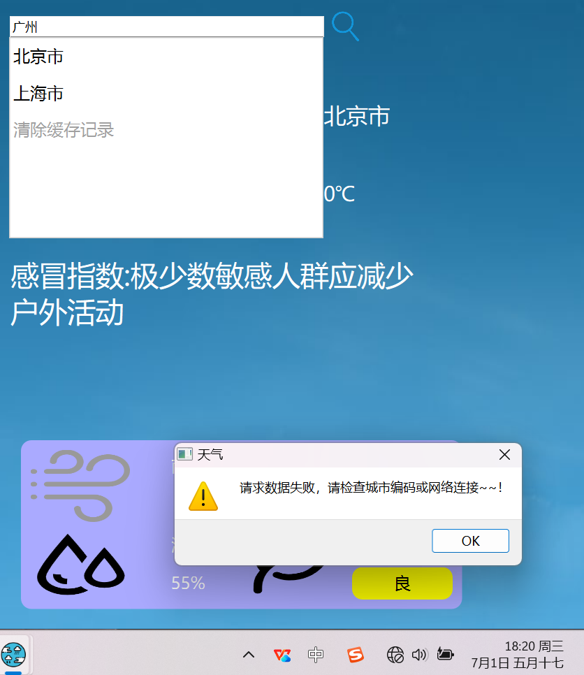

# ⛅ WeatherForecast 天气预报桌面客户端

[](https://opensource.org/licenses/MIT)
[](https://www.qt.io/)
[](https://en.cppreference.com/w/cpp/17)

> 基于 Qt 6 / C++17 的 Windows 桌面天气应用——从单文件 Widget 逐步重构为四层架构，涵盖网络通信、SQLite 缓存、iconfont 矢量图标、QPainter 自定义绘制等技术实践。

---

## 📖 项目概述

WeatherForecast 是一个基于 Qt 框架的 Windows 桌面天气客户端，调用 [t.weather.itboy.net](http://t.weather.itboy.net) 免费天气 API 获取实时气象数据。

项目设计关注以下几方面：

- **架构演进**：从单文件 Widget 逐步拆分出 `ApiClient`（网络层）、`DataCache`（缓存层）、`ChartWidget`（绘制层），实现职责分离
- **离线可用**：SQLite 本地缓存 + LRU 淘汰策略，断网时自动加载快照
- **工程健壮**：多级重试、IP 定位降级、预报日期自动校准、QSettings 窗口恢复
- **矢量图标**：使用 iconfont 字体替代散落 PNG，一份 JSON 驱动 80+ 天气图标映射

## ✨ 功能特性

| 功能模块 | 说明 |
|---------|------|
| IP 自动定位 | 首次启动通过 ipinfo.io 定位当前城市，自动回退到默认城市 |
| 城市搜索 | 内置 2800+ 城市数据库，支持中文名及"市"/"县"后缀自动纠错 |
| 最近访问 | 点击搜索框弹出历史城市下拉列表，选中即跳转；支持一键清除缓存 |
| 六天预报 | 昨天 / 今天 / 明天 + 后三天，含天气图标、温度范围、AQI 六色分级、风力风向 |
| 温度曲线 | QPainter 自定义绘制高低温折线图，虚线区分历史、实线表示预报，基于均值偏移算法 |
| 本地缓存 | SQLite 存储，LRU 策略保留最近 5 个城市，2 小时过期，含 pm10/日出日落/温馨提示全字段 |
| 窗口持久化 | QSettings 保存上次城市和窗口位置，启动自动恢复，含屏幕边界校验 |
| 系统托盘 | 托盘图标常驻，右键菜单最小化 / 退出，单击或双击恢复窗口 |
| 网络容错 | 首次失败即时弹窗，后台每 30 秒静默重试，最多 10 次（5 分钟） |
| iconfont 图标 | 字体驱动 80+ 天气图标，JSON 声明式映射，QPixmap 缓存渲染，支持复合天气别名 |
| 预报对齐 | 解析 API 服务端时间戳，自动校准"昨天/今天/明天"数据索引，解决凌晨数据滚动错位 |

## 🧱 架构设计

```
┌──────────────────────────────────────────────────┐
│  Widget（视图 + 控制器）                           │
│  · UI 布局与用户交互                               │
│  · 调度各模块、缓存优先策略                         │
│  · iconfont 加载 / QPainter 渲染 / 事件过滤        │
├────────────────────┬─────────────────────────────┤
│  ApiClient         │  DataCache                  │
│  (网络请求层)       │  (SQLite 缓存层)              │
│  · HTTP GET        │  · INSERT / SELECT / DELETE  │
│  · JSON 解析       │  · LRU 淘汰（最多 5 城）      │
│  · 预报日期对齐    │  · 2 小时过期                  │
│  · 30s×10 重试    │  · 全字段存储（含扩展字段）    │
│  · IP 定位降级    │  · 断网加载本地快照            │
├────────────────────┴─────────────────────────────┤
│  ChartWidget（温度曲线绘制）                       │
│  · QPainter 自定义 paintEvent                     │
│  · 均值偏移 Y 坐标算法                             │
│  · 高低温双曲线 / 虚线历史 / 实线预报             │
└──────────────────────────────────────────────────┘
```

### 缓存优先策略

```
启动 → QSettings.lastCityCode
     → DataCache::load() 命中? ──Y──→ updataUI() 显示缓存
                                 └──N──→ showDefaultUI() 占位
后台 → ApiClient 网络请求 ──→ 解析 JSON ──→ DataCache::save()
     → updataUI() 刷新
```

## 🗂️ 项目结构

```
WeatherForecast/
├── main.cpp                  # 程序入口（QSettings 组织名/应用名）
├── widget.h/.cpp/.ui         # 主窗口（视图 + 控制器，约 590 行）
├── apiclient.h/.cpp          # 网络请求与 JSON 解析（约 220 行）
├── datacache.h/.cpp          # SQLite 本地缓存层（约 225 行）
├── chartwidget.h/.cpp        # QPainter 温度曲线绘制（约 70 行）
├── weatherdata.h             # 数据模型 Today / Day（含 pm10/updateTime/sunrise/sunset/notice）
├── weatherTool.h             # 2800+ 城市编码映射工具（拼音 + 中文名 + 后缀纠错）
├── WeatherForecast.pro       # qmake 构建配置（QT += core gui network sql）
├── res.qrc                   # Qt 资源文件（嵌入式）
├── Cmake_WeatherForecast/    # CMake 构建副本（支持 Qt6/Qt5 双版本）
├── res/                      # 图标、背景、iconfont.ttf / iconfont.json
├── city_weather/             # 2800+ 城市数据库（city_weather.json）
└── docs/                     # 截图与项目分析文档
```

## 🖼️ 截图

| 主界面与温度曲线 | 六天预报与详情 |
|:---:|:---:|
|  |  |
| **城市搜索下拉列表** | **系统托盘** |
|  |  |

## 🛠️ 构建方式

### qmake

```bash
cd build
qmake ..\WeatherForecast.pro
mingw32-make -j4 release
```

> 若 SQLite 驱动未加载，将 `{Qt目录}/plugins/sqldrivers/qsqlite.dll` 复制到 exe 同级的 `sqldrivers/` 目录。

### CMake（支持 Qt6 / Qt5 双版本）

```bash
cd Cmake_WeatherForecast/WeatherForecast/build
cmake .. -G "MinGW Makefiles"
cmake --build . --config Release
```

## 🧰 技术栈

| 技术 | 用途 |
|------|------|
| C++17 | class 级 static inline、结构化绑定、lambda |
| Qt 6.5 Widgets | 完整 GUI 框架（窗口/布局/事件/信号槽） |
| QNetworkAccessManager | 异步 HTTP 请求 + JSON 解析 |
| QSqlite (QSQLITE) | 本地数据持久化，建表/增删改查 |
| QPainter | 温度曲线自定义绘制 + iconfont 图标渲染 |
| QSettings | Windows 注册表设置持久化 |
| iconfont | 80+ 天气矢量图标，JSON 驱动映射 |
| QSystemTrayIcon | 系统托盘常驻与交互 |

## 📚 项目亮点

- **分层重构**：单文件 Widget → ApiClient / DataCache / ChartWidget 三层独立模块
- **缓存策略**：LRU + TTL 双重淘汰，优先加载缓存再后台刷新，零等待体验
- **预报对齐**：解析 API `time` 字段自动校准"昨天/今天/明天"索引，解决凌晨数据滚动错位
- **icons 系统**：iconfont 字体替代 40+ 离散 PNG，82 个 glyph 覆盖常见天气类型，QPixmap 缓存避免重复渲染
- **错误容错**：多级重试（首次弹窗 + 30s×10 静默重试） + IP 定位降级 + 缓存快照兜底
- **双构建系统**：同时维护 qmake 和 CMake 两套方案，CMake 版支持 Qt6/Qt5 自动检测

## 📬 联系方式

- **GitHub**: [yiyinideshang](https://github.com/yiyinideshang)
- **项目地址**: [github.com/yiyinideshang/Qt_WeatherForecast](https://github.com/yiyinideshang/Qt_WeatherForecast)
- **Email**: 2779271357@qq.com

---

Built with ❤️ and Qt
